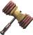

# <Your-Project-Title>

## Description

This is a study guide designed to help me understand the steps I took to create it so that I can use it in the future to create simular
applications. This project was designed to inform me of every single aspect of the process that goes behind web development such as
HTML, CSS, Git, and all that. It was very informitive of teaching me the basics of these computer languages and applications.

## Table of Contents

- [Installation](#installation)
- [Usage](#usage)
- [Credits](#credits)
- [License](#license)

## Installation

N/A

## Usage

This can be used to teach yourself more about how to follow in the steps of web development and its source code can be inspected to view an
easy simple and plain website.

## Credits

Me!

## License

Please refer to the LICENSE in the repo.
